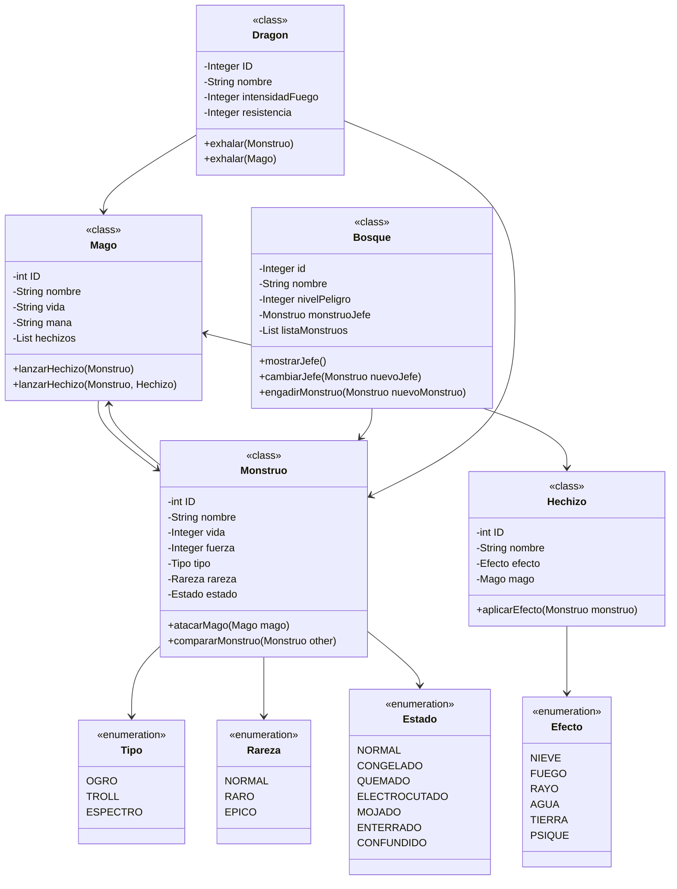
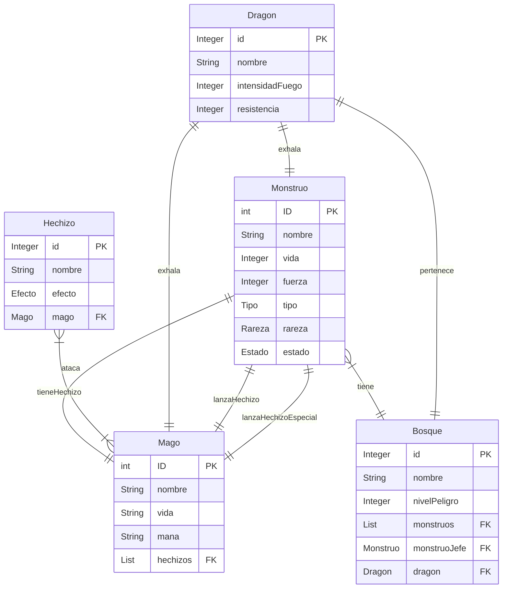

# DRAGOLANDIA - VERSIÓN 2

#### Autor: Manuel Dono Araújo

## INTRODUCCIÓN

Dragolandia consiste de un juego de rol de combate por turnos, en el que el jugador toma control de un mago y se adentra en un bosque para enfrentarse a diferentes monstruos.

El jugador debera determinar sus estadisticas antes de adentrarse en el bosque, en el cual se encontrara con diferentes tipos de monstrous. El combate sera por turnos, en el que cada parte debera usar su turno para realizar ataques y movimientos.

Un mago tiene acceso a una lista de hechizos, los cuales puede usar para atacar a un monstruo. Al atacar al monstruo con uno de esos hechizos (asignados aleatoriamente), se le pasara un efecto especifico al monstruo.

Existe un dragón que solo puede habitar en un bosque. Este puede exhalar fuego.

## ANALISIS

El programa esta compuesto de las siguientes clases: Bosque, Monstruo, Mago, Hechizo. Cada uno tiene los siguientes atributos:

- Mago: id, nombre, vida, mana, hechizos
- Hechizo: id, nombre, efecto, mago
- Monstruo: id, nombre, vida, fuerza, tipo, rareza, estado
- Bosque: id, nombre, nivelPeligro, monstruoJefe, listaMonstruos
- Dragon: id, nombre, intensidadFuego, resistencia

#### DIAGRAMA DE CLASES

## DISEÑO

El juego esta diseñado de la siguiente forma:

- Un bosque alberga una lista de monstruos, y de ellos se establece un monstruo jefe. 

- En ese bosque, un mago entra. El mago lucha con los monstruos del bosque. 

- En un bosque, también habita un dragón. Un dragón podra atacar a un monstruo o mago con su aliento de fuego.

- Un monstruo puede ser de un tipo y rareza especificos, y puede tener uno o varios efectos.

- Un mago tiene una serie de hechizos. Con ellos, puede utilizarlos para aplicar efectos al monstruo que este atacando.

#### DIAGRAMA ENTIDAD-RELACIÓN

